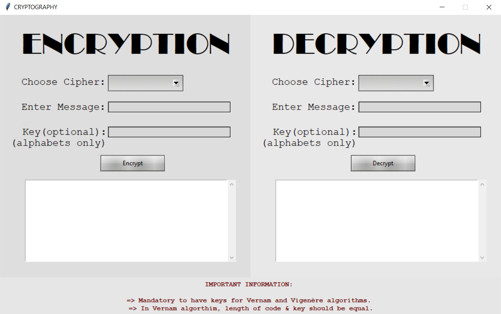

# Cipher Converter
A simple app that allows the client to encrypt and decrypt messages from multiple ciphers. This includes Caesar Cipher, Vernam cipher, and Vigenere cipher.


## Table of Contents
- [Purpose](#purpose)
- [Technologies and Libraries Used](#technologies-and-libraries-used)
- [Setup](#setup)
- [Repository Information](#repository-information)
- [Usage](#usage)


## Purpose
This project was created to learn more about how ciphers work and understand the importance of ciphers in the world of cryptography. As I wish to pursue a career in the field of cybersecurity, I wanted to learn more about how encryption and decryption works.
I also wanted to learn more about the tkinter library and how to create a GUI with it. Thus, I decided to create a graphical user interface based application that allows the user to encrypt and decrypt messages from multiple ciphers.


## Technologies and Libraries Used
- Programming Language:
    - Python
- Libraries:
    - string
    - tkinter
    - ttkthemes
    - tkinter.scrolledtext


## Setup
Make sure you have the latest version of Python installed and also install the libraries mentioned above.

## Repository Information
The main.py file contains the code for the GUI and the functions for each cipher for encrption and decryption.

## Usage



```
```

To run the program, run the main.py file. This will open up the GUI. To use the application, follow the steps below:
- For encryption
    - Select the cipher you want to use
    - Enter the message you want to encrypt
    - Enter the key for the cipher (mandatory for Vernam and Vigenere cipher)
- For decryption
    - Select the cipher you want to use
    - Enter the message you want to decrypt
    - Enter the key for the cipher (mandatory for Vernam and Vigenere cipher)